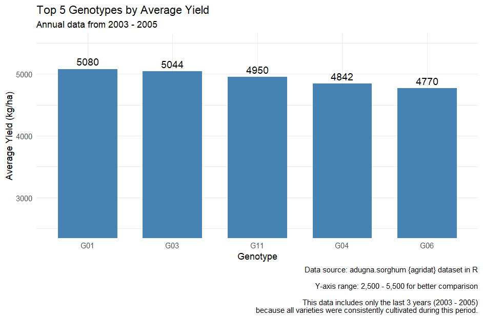
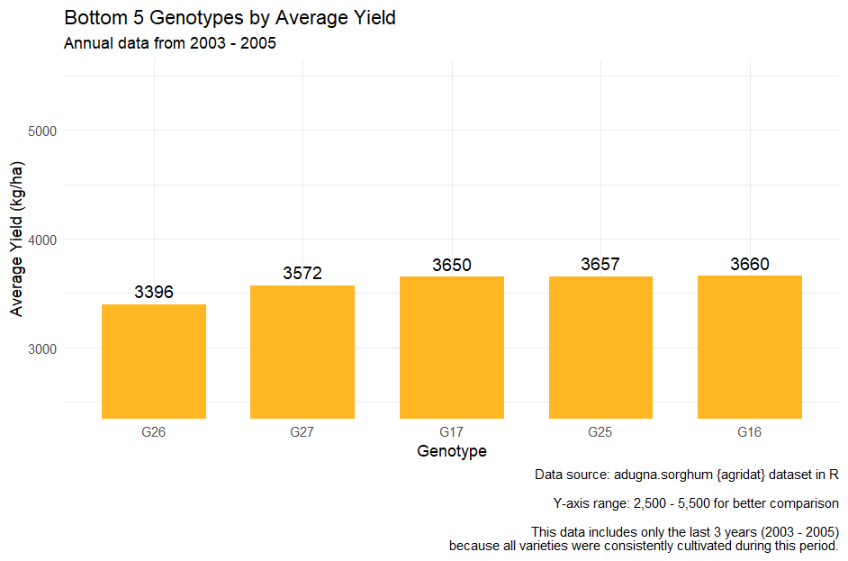
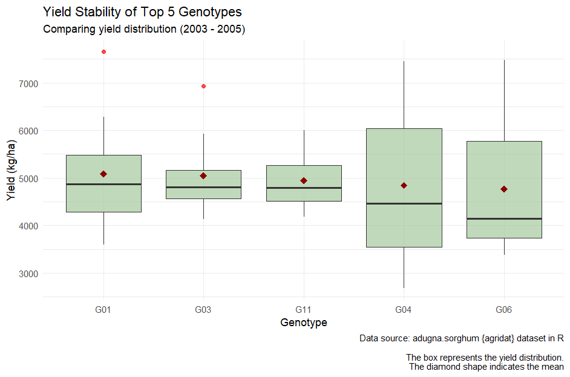
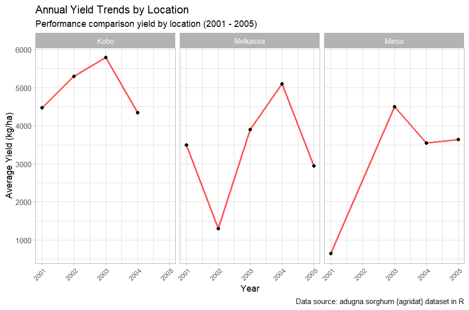
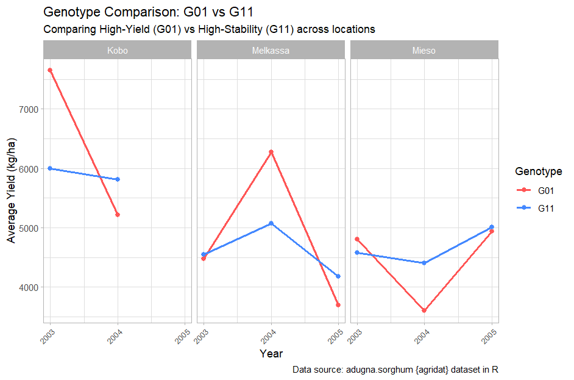

# 🌾 Project Title & Objective
 

**Title:** Sorghum Yield Analysis (2001-2005)
 
**Objective**
- This project analyzes the performance of 28 sorghum genotypes across three different locations: Kobo, Melkassa, and Mieso.
- The goal is to identify which seeds provide the highest yields or most stability for farmers.

📑 You can find the full Analysis report (PDF) [sorghum_yield_analysis_report](sorghum_yield_analysis_report.pdf).

 

# 📢 Main Analysis
 

### 1. Top 5 High-Yield Genotypes

 

**📝 Summary**
 
This chart identifies the top five varieties with the highest average yield. These findings provide a data-driven basis for recommending the most productive varieties for large-scale farming.

 

### 2. Bottom 5 Low-Yield Genotypes

 

 

**📝 Summary**
 
This chart identifies the five varieties with the lowest average yield. These results help decision-makers consider excluding them from future planting plans to reduce farming costs.

 

### 3. Yield Stability

 

 

 

*Note: Standard Deviation (SD) indicates the yield stability; a lower SD means higher consistency.*

 

**📝 Summary**
 
- **Most Reliable:** G11 is the most stable genotype. It has the shortest overall range (whiskers) and the lowest SD (661), meaning the yield is highly consistent.
- **High Potential with Risk:** G01 and G03 have the highest average yields. They have high outliers (nearly 8,000 kg/ha), showing great potential, but they have more variation than G11.
- **Low Consistency:** G04 and G06 show high variance. Their average deviation from the median is very high (up to 632), and their boxes are the largest, which means their yield is unpredictable.
- **Business Recommendation:** We should recommend G11 for farmers who want steady income, and G01 for those who want to reach the highest possible yield.

 

### 4. Yearly Yield Trends by Location

 

 

**📝 Summary**
 
- **Best Location:** Kobo is the top performer. It reached the highest yield of nearly 6,000 kg/ha in 2003.
- **The 2003 Peak:** All three locations showed a significant increase (jump) in yield in 2003. This happened when new genotypes (G01–G15) were introduced for testing.
- **High Volatility:** Melkassa is the least stable location. It had a deep drop in 2002 before recovering later.
- **Note:** This analysis focuses on location potential and genotypes. External factors like weather or soil data were not available.

 

### 5. Genotype Comparison

 

 

**📝 Summary**
 
- **Yield vs. Stability:** G01 shows high volatility (sharp upward and downward movements) in all three locations. While G11 is much more stable than G01.
- **Location Recommendation (Mieso):** For cultivation in Mieso, G11 is highly recommended over G01. The Mieso graph shows that G11 performs better overall and remains more consistent throughout the years.
- **G01 (High Risk, High Reward):** G01 is suitable for farmers who want the highest possible yield, but they must accept high risk from its unpredictability.
- **G11 (Safe & Steady):** G11 is suitable for farmers who prefer a consistent income. It provides a steady yield even when conditions change.
- **Final Choice:** If the priority is maximum profit, choose G01. If the priority is low risk, choose G11.

 

# 🔑 Key Findings:
- **Best Location:** Kobo is the most productive area for sorghum cultivation.
- **The Turning Point:** In 2003, we saw a massive "jump" in yields due to the introduction of new genotypes (G01–G15).
- **The Champion Battle:** G01 is the leader for High Yield but has high risk. Meanwhile, G11 is the best for Stability, making it the safest choice, especially for the Mieso location.
